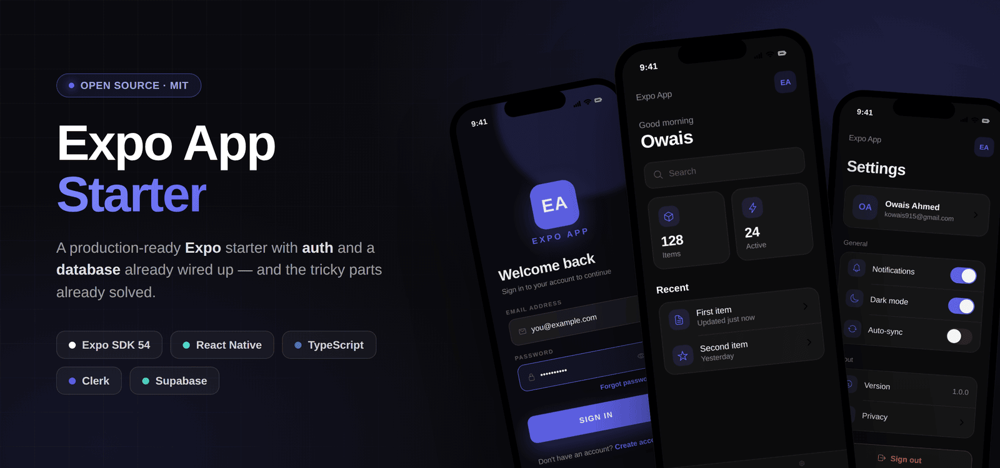

<div align="center">



<br />
<br />

# Expo App Starter

**A production-ready Expo starter with authentication and a database already wired up — and the tricky parts already solved.**

Stop rebuilding auth for every new app. Clone this, change one color, and start shipping features.

[](https://expo.dev)
[](https://reactnative.dev)
[](https://www.typescriptlang.org)
[](https://clerk.com)
[](https://supabase.com)

[](./LICENSE)
[](./CONTRIBUTING.md)

</div>

---

📋 **[Changelog](./CHANGELOG.md)** — already cloned this? Each release links a
compare view so you can see exactly what changed and cherry-pick.

## Why this exists

Every new mobile app needs the same boilerplate: sign in, sign up, email verification, an auth-gated area, a database client, theming, settings. Getting auth and a database to play nicely — and dodging the subtle bugs (token-refresh reloads, cold-start flashes, "session already exists") — eats days. This template has all of it done and hardened, so you can start on the part that's actually your app.

> **Not married to the stack.** Clerk and Supabase are the batteries-included *defaults*. Auth is contained in `app/(auth)` + the token cache, and all data access goes through `lib/supabase.ts` — so swapping in a different auth or database provider is an isolated change, not a rewrite.

## Features

- 🔐 **Full auth flow** — sign in, sign up, and email verification via [Clerk](https://clerk.com), with an auth-gated tab group and clean redirects.
- 🗄️ **Supabase, the right way** — Clerk's **native** integration (no deprecated JWT template) with a single, stable authenticated client for row-level security.
- 🎨 **One-knob theming** — dark/light with a persisted toggle, a typed palette, and a single `ACCENT` color that recolors the entire app.
- 🧭 **Navigation** — [Expo Router](https://docs.expo.dev/router/introduction/) file-based routing, a custom bottom tab bar, and a swipe-to-dismiss settings drawer.
- 🧱 **Sensible components** — a reusable header and a monogram logo generated from your app name.
- 🧪 **Tests that run on `npm test`** — Jest + React Native Testing Library, with the native modules that normally throw under Node already mocked (safe-area, Secure Store, AsyncStorage, Clerk).
- ✅ **TypeScript throughout**, strict and clean.

### Already hardened for you

These are the Clerk/Expo footguns most starters miss — solved here:

- **No token-refresh flash.** The Supabase client is created once and reads the latest token via a ref, so Clerk's ~1-minute token rotation never rebuilds the client or reloads your screens.
- **No cold-start flash.** A splash cover holds until the session resolves and the visible route matches — you never see the wrong screen for a frame.
- **No "Session already exists."** A single route guard owns every post-auth redirect, so auth screens never navigate after `setActive` — two redirects racing on one state change is what leaves apps stuck on a splash cover.
- **The splash cover can't strand you.** If a redirect never lands, a failsafe drops the cover and re-asserts the destination rather than hanging forever.
- **Keyboard doesn't bury your buttons — on either platform.** `automaticallyAdjustKeyboardInsets` is iOS-only and `KeyboardAvoidingView` has no working Android behavior under edge-to-edge, so `useKeyboardHeight()` measures it directly.

## Tech stack

| | |
| --- | --- |
| **Framework** | Expo (SDK 54) + React Native 0.81, New Architecture |
| **Navigation** | Expo Router |
| **Auth** | Clerk |
| **Database** | Supabase (Postgres + RLS) |
| **Language** | TypeScript |
| **Storage** | Expo Secure Store (theme + token cache) |

## Quick start

```bash
# 1. Use this template (GitHub: "Use this template") or clone it
git clone <your-fork-url> my-app && cd my-app

# 2. Install
npm install

# 3. Configure
cp .env.example .env.local   # fill in your Clerk + Supabase keys

# 4. Run
npx expo start

# Also available
npm test          # Jest + React Native Testing Library
npm run typecheck # tsc --noEmit
```

### Environment

Set these in `.env.local` (gitignored):

| Variable | Where to get it |
| --- | --- |
| `EXPO_PUBLIC_CLERK_PUBLISHABLE_KEY` | Clerk dashboard → API Keys |
| `EXPO_PUBLIC_SUPABASE_URL` | Supabase → Project Settings → API |
| `EXPO_PUBLIC_SUPABASE_ANON_KEY` | Supabase → Project Settings → API (publishable/anon key) |

### Connect Clerk ↔ Supabase (for RLS)

This uses Clerk's **native** integration — no JWT template, no shared secret. Two one-time dashboard steps:

1. **Clerk** → Integrations → Supabase → activate → copy the Clerk domain.
2. **Supabase** → Authentication → Sign In / Providers → **Third-Party Auth** → add Clerk → paste that domain.

Then read the Clerk user id in your RLS policies with `auth.jwt() ->> 'sub'`, and query with the hook:

```ts
const db = useSupabaseClient();
const { data } = await db.from('your_table').select();
```

> Repeat for each Clerk instance (development and production are separate instances with different domains).

## Rebranding for your app

1. **Accent color** — change `ACCENT` in `lib/theme.tsx`. One line recolors buttons, tabs, links, and focus states.
2. **App name** — `app.json` (`name`, `slug`, `scheme`, iOS `bundleIdentifier`, Android `package`) and `package.json` (`name`). The header, auth screens, and logo read the name from `app.json` at runtime.
3. **Keys** — point `.env.local` at your app's Clerk instance and Supabase project.
4. **Art** — swap `assets/` icons, the auth backgrounds (`assets/images/sign-*-bg.jpg`), and `components/Logo.tsx`.
5. **Screens** — the Home tab is placeholder scaffolding; build your real screens in `app/(tabs)/`.

## Project structure

```
app/
  _layout.tsx        Clerk + Theme providers, auth redirect + splash guard
  (auth)/            sign-in, sign-up, verify
  (tabs)/            Home + Settings, custom tab bar, signed-in gate
components/          Header, Logo, settings drawer
lib/                 theme (+ ACCENT), supabase client, clerk token cache
```

Native `ios/` and `android/` folders are generated — run `npx expo prebuild` (or an EAS build) when you need them.

## Contributing

Contributions are welcome. Please read the [contributing guide](./CONTRIBUTING.md) before opening a pull request.

## License

[MIT](./LICENSE) — free to use in personal and commercial projects.
